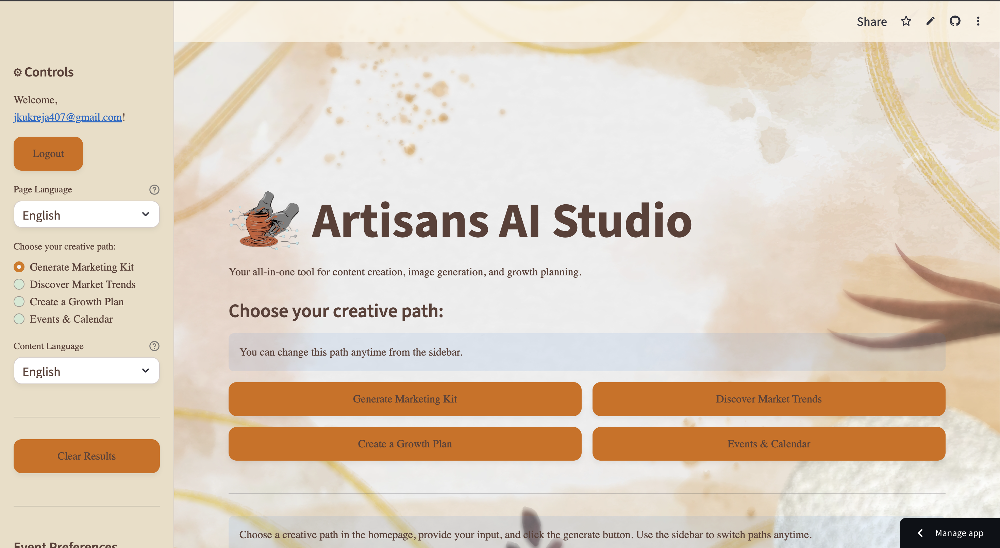

# 🌟 Artisans GenAI  

<p align="center">
  
</p>  

## 🎨 Introduction  
**Artisans GenAI** is a Streamlit-based web application that integrates **Google Generative AI** with **Firebase authentication** to empower artisans and creators.  

It enables authenticated users to:  
✨ Interact with AI models  
✨ Explore generative design ideas  
✨ Manage and schedule creative sessions  

---

## 📑 Table of Contents  
- [🌟 Artisans GenAI](#-artisans-genai)
  - [🎨 Introduction](#-introduction)
  - [📑 Table of Contents](#-table-of-contents)
  - [👀 Preview](#-preview)
  - [🚀 Features](#-features)
  - [🛠️ Installation](#️-installation)
  - [💻 Usage](#-usage)
  - [📦 Dependencies](#-dependencies)
  - [⚙️ Configuration](#️-configuration)
  - [🧩 Examples](#-examples)
  - [🛠️ Troubleshooting](#️-troubleshooting)
  - [👨‍💻 Contributors](#-contributors)
  - [@jatin-encrypted](#jatin-encrypted)
  - [@Tvaibhav06](#tvaibhav06)
  - [📜 License](#-license)

---

## 👀 Preview  

Here’s a sneak peek of the app in action:  

<p align="center">
    
  <br/>
  <em>🔐 Login page with Firebase authentication (placeholder)</em>
</p>  

👉 Once you run `frontend.py`, take **real screenshots** of:  
- Login page (Firebase Auth in Streamlit)  
- Main dashboard with AI interaction  
- Calendar view (`streamlit-calendar`)  

Save them in a folder like `assets/` and update the README image paths, e.g.:  
```markdown


## 🚀 Features

🔐 User Authentication with Firebase

🤖 Generative AI Models powered by Google

🖼️ Custom UI with artisan branding

🗓️ Calendar Scheduling for collaboration

🎛️ Streamlit-powered Interface

## 🛠️ Installation
git clone https://github.com/jatin-encrypted/Artisans-GenAI.git
cd Artisans-GenAI
python -m venv venv
source venv/bin/activate   # Windows: venv\Scripts\activate
pip install -r requirements.txt

## 💻 Usage
streamlit run frontend.py

## 📦 Dependencies

From requirements.txt:

streamlit – UI framework

google-generativeai, vertexai – AI integration

firebase-admin, pyrebase4 – Firebase auth & DB

streamlit-authenticator – Login system

streamlit-calendar – Schedule manager

Pillow, PyYAML – Utilities

## ⚙️ Configuration

Firebase Setup – Create project, download Admin SDK JSON, update firebase_auth.py.

Google Cloud Setup – Enable Vertex AI + Generative AI APIs.

Secrets / Env Vars – Store credentials in .streamlit/secrets.toml or .env.

## 🧩 Examples

Generate design concepts with AI

Organize artisan workshops with calendar integration

Customize branding with your own logo

## 🛠️ Troubleshooting

Login issues → Check Firebase config

API errors → Ensure Google Cloud APIs are enabled

Streamlit errors → Run pip install -r requirements.txt

## 👨‍💻 Contributors

## @jatin-encrypted
## @Tvaibhav06

## 📜 License  

This project is licensed under the [MIT License](LICENSE).

 
