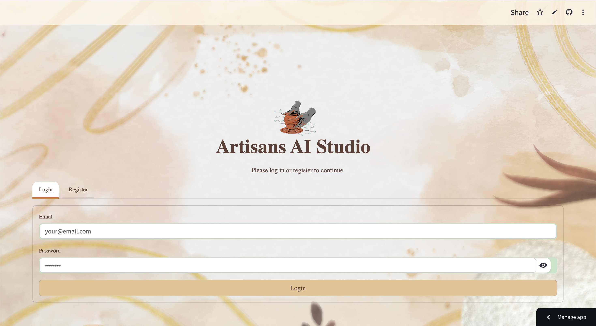

# 🌟 Artisans GenAI
<!-- Badges -->
<p align="center">
  
  
  <a href="#-license"></a>
</p>

<!-- Live deployment -->
🔗 Live App: https://artisansai-studios.streamlit.app/

<p align="center">
  
</p>

Empowering artisans and creators with AI-assisted ideation, scheduling, and workflow tools using Streamlit, Google Generative AI, and Firebase.

---

## 📑 Table of Contents
- [🌟 Artisans GenAI](#-artisans-genai)
  - [📑 Table of Contents](#-table-of-contents)
  - [🎨 Introduction](#-introduction)
  - [🚀 Features](#-features)
  - [🏗️ Architecture](#️-architecture)
  - [🗂️ Project Structure](#️-project-structure)
  - [🛠️ Installation](#️-installation)
  - [⚙️ Configuration](#️-configuration)
    - [1. Firebase Setup](#1-firebase-setup)
    - [2. Google Generative / Vertex AI](#2-google-generative--vertex-ai)
    - [3. Streamlit Secrets](#3-streamlit-secrets)
  - [🔐 Environment Variables / Secrets](#-environment-variables--secrets)
  - [💻 Usage](#-usage)
  - [🧪 Development \& Testing](#-development--testing)
  - [🖼️ Screenshots](#️-screenshots)
  - [🧩 Extending (Add Your Own AI Model)](#-extending-add-your-own-ai-model)
  - [🛠️ Troubleshooting](#️-troubleshooting)
  - [🗺️ Roadmap](#️-roadmap)
  - [🤝 Contributing](#-contributing)
  - [👨‍💻 Contributors](#-contributors)
  - [📜 License](#-license)

---

## 🎨 Introduction
Artisans GenAI is a Streamlit application that blends conversational AI, creative design prompting, and calendar-based planning. Authenticated users can:
- Brainstorm product or craft ideas.
- Generate design narratives or workshop outlines.
- Schedule collaborative sessions.

---

## 🚀 Features
- 🔐 Firebase-backed user authentication
- 🤖 Google Generative AI (Gemini / Vertex AI ready)
- 🗓️ Integrated scheduling (streamlit-calendar)
- 💬 Prompt → Response conversational UI
- 🖼️ Asset-ready interface for branding
- 🔌 Modular services layer for future model providers
- 🧱 Config-driven secrets & environment isolation

---

## 🏗️ Architecture
High-level:
1. Streamlit frontend (session state, auth gating, UI components)
2. Firebase (Auth + optional Firestore/Realtime DB for persistence)
3. Google Generative AI / Vertex AI for text (and future multimodal) generation
4. Calendar component for organizing creative sessions

Data Flow (simplified):
User → Auth (Firebase) → UI → Prompt Service → Google GenAI → Response rendered → Optional save

---

## 🗂️ Project Structure
```
artisans_ai/
  frontend.py
  firebase_auth.py
  ai/
    prompts.py
    providers/
      google_genai.py
  assets/
    logo.gif
    (add: login.png, dashboard.png, calendar.png)
  .streamlit/
    secrets.toml (gitignored)
  requirements.txt
  README.md
```
(Adjust as your actual layout evolves.)

---

## 🛠️ Installation
```bash
git clone https://github.com/jatin-encrypted/Artisans-GenAI.git
cd Artisans-GenAI

python -m venv venv
# macOS / Linux
source venv/bin/activate
# Windows (Powershell)
venv\Scripts\Activate.ps1

pip install --upgrade pip
pip install -r requirements.txt
```
Optional (editable dev mode):
```bash
pip install -e .
```

---

## ⚙️ Configuration
### 1. Firebase Setup
1. Create Firebase project
2. Enable Authentication (Email/Password or others)
3. (If used) Create Firestore or Realtime Database
4. Generate Admin SDK private key (Service Account) JSON
5. Store JSON securely (do NOT commit). Reference path via env/secret.

### 2. Google Generative / Vertex AI
1. Create Google Cloud project
2. Enable: Vertex AI API + Generative Language API
3. Create API key (standard) OR set up service account for Vertex
4. Note: Vertex region (e.g., us-central1) if using advanced models

### 3. Streamlit Secrets
Preferred approach: .streamlit/secrets.toml
Example below.

---

## 🔐 Environment Variables / Secrets
Choose one strategy:
A. secrets.toml (recommended for Streamlit)
B. .env file + python-dotenv (if you add it)
C. Direct OS environment variables (CI/CD friendly)

Example secrets.toml:
```toml
[firebase]
api_key = "YOUR_FIREBASE_WEB_API_KEY"
auth_domain = "yourapp.firebaseapp.com"
project_id = "yourapp"
storage_bucket = "yourapp.appspot.com"
messaging_sender_id = "1234567890"
app_id = "1:1234567890:web:abc123"
service_account_json = "/absolute/path/to/serviceAccountKey.json"

[google_ai]
api_key = "GOOGLE_GENERATIVE_AI_API_KEY"
vertex_project = "gcp-project-id"
vertex_location = "us-central1"

[app]
default_model = "gemini-pro"
```

If using environment variables:
```
FIREBASE_API_KEY=...
GOOGLE_GENAI_API_KEY=...
VERTEX_PROJECT=...
VERTEX_LOCATION=us-central1
```

---

## 💻 Usage
Access (deployed): https://artisansai-studios.streamlit.app/
```bash
streamlit run frontend.py
```

If you have multiple secrets profiles:
```bash
STREAMLIT_SECRETS_FILE=.streamlit/secrets.toml streamlit run frontend.py
```

Then:
1. Open the provided local URL
2. Log in / Sign up (depending on implemented flow)
3. Enter prompts in the AI panel
4. Use calendar to assign sessions or notes

---

## 🧪 Development & Testing
Lint (if you add flake8/ruff):
```bash
ruff check .
```
Basic manual test checklist:
- Invalid login rejected
- Valid login persists session
- Prompt returns AI response
- Calendar events render properly
Add automated tests under tests/ (not included yet).

---

## 🖼️ Screenshots
Below are current UI screenshots (click to open full size):

| Login                                          | Dashboard                                                  |
| ---------------------------------------------- | ---------------------------------------------------------- |
| [](assets/login.png) | [](assets/dashboard.png) |

---

## 🧩 Extending (Add Your Own AI Model)
1. Create new provider file under ai/providers/
2. Expose a generate_text(prompt: str, **kwargs) function
3. Add a registry entry (e.g., in prompts.py or a providers index)
4. Update model select UI in frontend.py to include provider key

---

## 🛠️ Troubleshooting
| Issue                       | Check                                |
| --------------------------- | ------------------------------------ |
| Firebase auth fails         | API key + authDomain mismatch        |
| 403 / Quota errors          | Google API enabled? Billing active?  |
| Streamlit secrets not found | Path .streamlit/secrets.toml exists? |
| Calendar not loading        | Component version / network console  |
| Unicode issues              | Ensure UTF-8 environment locale      |

Quick reset:
```bash
pip install --force-reinstall -r requirements.txt
```

---

## 🗺️ Roadmap
- [ ] Persistent chat history (Firestore)
- [ ] Multi-user shared boards
- [ ] Image generation integration
- [ ] Role-based access (e.g., facilitator vs creator)
- [ ] Export sessions (PDF/Markdown)

---

## 🤝 Contributing
1. Fork repository
2. Create feature branch: git checkout -b feat/your-feature
3. Commit: git commit -m "feat: add your feature"
4. Push: git push origin feat/your-feature
5. Open Pull Request

Please keep commits scoped and follow conventional messages where possible.

---

## 👨‍💻 Contributors
- @jatin-encrypted
- @Tvaibhav06

(Feel free to add yourself via PR.)

---

## 📜 License
MIT License

Copyright (c) 2025 Artisans GenAI contributors

Permission is hereby granted, free of charge, to any person obtaining a copy of this software and associated documentation files (the “Software”), to deal in the Software without restriction, including without limitation the rights to use, copy, modify, merge, publish, distribute, sublicense, and/or sell copies of the Software, and to permit persons to whom the Software is furnished to do so, subject to the following conditions:

The above copyright notice and this permission notice shall be included in all copies or substantial portions of the Software.

THE SOFTWARE IS PROVIDED “AS IS”, WITHOUT WARRANTY OF ANY KIND, EXPRESS OR IMPLIED, INCLUDING BUT NOT LIMITED TO THE WARRANTIES OF MERCHANTABILITY, FITNESS FOR A PARTICULAR PURPOSE AND NONINFRINGEMENT. IN NO EVENT SHALL THE AUTHORS OR COPYRIGHT HOLDERS BE LIABLE FOR ANY CLAIM, DAMAGES OR OTHER LIABILITY, WHETHER IN AN ACTION OF CONTRACT, TORT OR OTHERWISE, ARISING FROM, OUT OF OR IN CONNECTION WITH THE SOFTWARE OR THE USE OR OTHER DEALINGS IN THE SOFTWARE.

---

